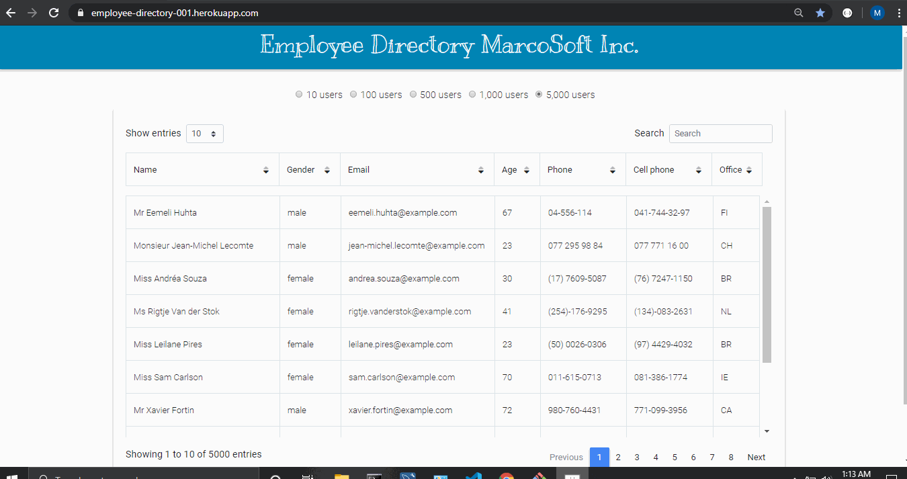

# Purpose of the application

We have been tasked with creating a REACT application that shows a list of employee information.  The application will initially list a default list of 100 users randomly selected.  The user, will then have the opportunity to perform the following actions:

* Sort the list either ascending or descending based on any of the fields
* Filter or search (same end-result) by entering a string or partial string on the search box.  The application will search the name and will show only the rows that contain the string entered in the search box.

Overall, we used www.randomuser.me as the random user data generator.  We also used Material Design Bootstrap datatable to render the information.  We used older generation functionality such as Bootrstap and Google fonts.  Finally, wrapped all of the logic using Facebook's react library to build the overall application, as required by the assignment.

Next, we will discuss the data available and the technology/plugins used to build this application.

## User Data

Data is provided by the website https://randomuser.me/, which is a free, open-source API for generating random user data.  None of the information is real, even if it looks so.

The API is called by using a simple fetch call such as  fetch("https://randomuser.me/api/") and specifying the number of records to be fetched.

The response is in JSON format.  We found this API to be simple for our purposes.  Given it is free, latency is variable but generally tolerable for this particular application.

##  Material Design Bootstrap datatable

As in our prior group projects, we have leveraged the versatility of dataTables from both Material Design Bootrstrap and CDN tables.  Material Design Bootrstrap was selected this time around since they have a solution for React.  We have, therefore chosen to use their implementation to present the results fetched from the randomuser API.

The table presents a total of 10 users at the time.  This setting can be changed to include up to 100 records.  The table allows to paginate to access the records not visible in the current screen.  The table allows to also sort by any of the columns either ascending or descending.  Finally, the table provides a search box which acts as a filter that shows only those records whose name contains the text entered.

##  Deployment to Heroku

This application has been deployed to Heroku at https://employee-directory-001.herokuapp.com/

##  Overall application demonstration

